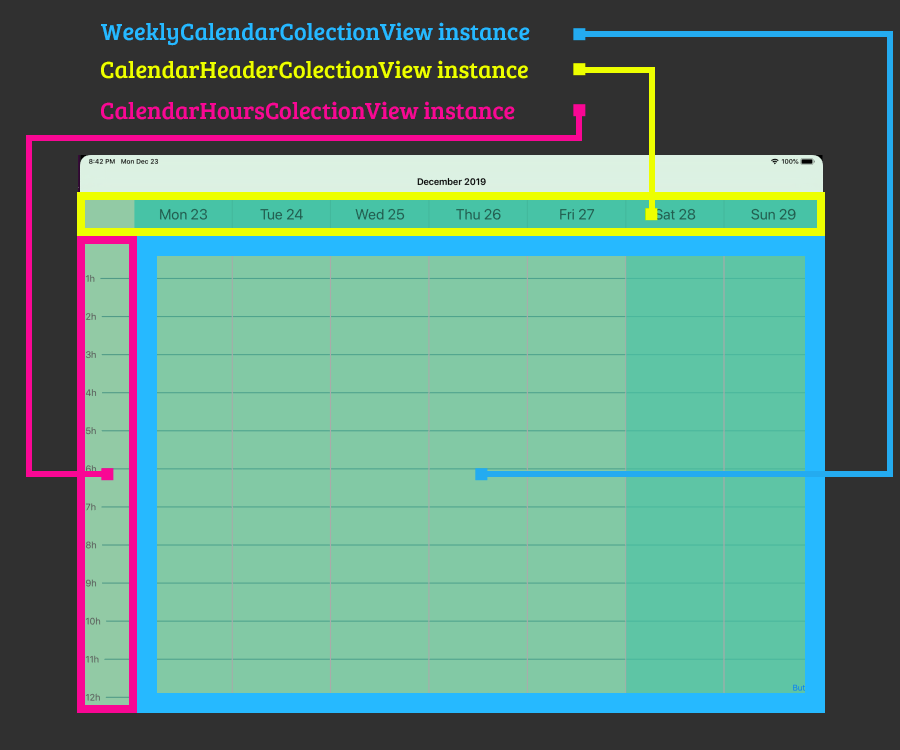

# SwiftWeeklyCalendar

[](https://travis-ci.org/mmachado53/SwiftWeeklyCalendar)
[](https://cocoapods.org/pods/SwiftWeeklyCalendar)
[](https://cocoapods.org/pods/SwiftWeeklyCalendar)
[](https://cocoapods.org/pods/SwiftWeeklyCalendar)


This calendar works like the native iOS weekly calendar, it can be scrolled horizontally and vertically, horizontally if the swipe gesture is long scrolls to the next or previous week, if it is short it scrolls to the next or previous day

## Important
It's in Swift 5 for iOS 10 or higher
## Example

To run the example project, clone the repo, and run `pod install` from the Example directory first.

## Installation

SwiftWeeklyCalendar is available through [CocoaPods](https://cocoapods.org). To install
it, simply add the following line to your Podfile:

```ruby
pod 'SwiftWeeklyCalendar'
```

## Author

mmachado53, mmachado53@gmail.com

## Usage

### Basic concepts


#### Class WeeklyCalendarCollectionView
WeeklyCalendarCollectionView is the base of the calendar and extends of UICollectionView

#### WeeklyCalendarCollectionView Outlet´s (properties accessible from interface builder)

##### - calendarDelegate:WeeklyCalendarCollectionViewDelegate?
##### - headerCollectionView:CalendarHeaderCollectionView?
##### - hoursCollectionView:CalendarHoursCollectionView?
##### - customHeightPerHour:CGFloat = -1 (if a different value is not set, it cannot be scrolled vertically)
##### - paddingTop:CGFloat = 0

#### WeeklyCalendarCollectionView public properties

##### - dayCellSize:CGSize : is the current size of the cells, width = frame.width / 7, height = customHeightPerHour * 24

#### WeeklyCalendarCollectionView public methods

#### - setDate(date:Date) : Navigate to specific Date

#### Class CalendarHeaderCollectionView
CalendarHeaderCollectionView is the view where you can show the days of the week and extends of UICollectionView

#### CalendarHeaderCollectionView Outlet´s (properties accessible from interface builder)

##### - calendarHeaderDelegate:CalendarHeaderCollectionViewDelegate?

#### Class CalendarHoursCollectionView
CalendarHoursCollectionView is the view where you can show the hours and extends of UICollectionView

#### CalendarHoursCollectionView Outlet´s (properties accessible from interface builder)

##### - calendarHoursDelegate:CalendarHoursCollectionViewDelegate?

## Protocols. Delegate´s usage

```swift
CustomViewController.swift
import SwiftWeeklyCalendar

extension CustomViewController : WeeklyCalendarCollectionViewDelegate{

    func weeklyCalendarCollectionView(_ collectionView: WeeklyCalendarCollectionView, cellFor date: Date, indexPath: IndexPath) -> UICollectionViewCell {
        let cell:UICollectionViewCell = collectionView.dequeueReusableCell(withReuseIdentifier: "cellidentifier", for: indexPath)
        // Configure here the cell view for date in WeeklyCalendarCollectionView instance
        return cell
    }
    
    func weeklyCalendarCollectionView(collectionView: WeeklyCalendarCollectionView, changeWeek dates: [Date]) {
        // "dates" its an array with visible dates
        // do something when the calendar has changed date
    }
    
    func weeklyCalendarCollectionView(collectionView: WeeklyCalendarCollectionView, didSelectItemAt cellState: Date) {

    }
    
    
}

extension CustomViewController : CalendarHeaderCollectionViewDelegate {
    func calendarHeaderCollectionView(_ collectionView: CalendarHeaderCollectionView, cellFor date: Date, indexPath: IndexPath) -> UICollectionViewCell {
        let cell:UICollectionViewCell = collectionView.dequeueReusableCell(withReuseIdentifier: "cellidentifier", for: indexPath)
        
        // Configure here the cell view for headers in the CalendarHeaderCollectionView instance
     
        return cell
    }
    
    
}

extension CustomViewController : CalendarHoursCollectionViewDelegate {
    func calendarHoursCollectionView(_ collectionView: CalendarHoursCollectionView, cellFor hour: Int, indexPath: IndexPath) -> UICollectionViewCell {
        let cell:UICollectionViewCell = collectionView.dequeueReusableCell(withReuseIdentifier: "cellidentifier", for: indexPath)
                
        // Configure here the cell view for headers in the CalendarHoursCollectionView instance
             
        return cell
    }
    
    
}

```


## Video tutorial
soon :)

 


## License

SwiftWeeklyCalendar is available under the MIT license. See the LICENSE file for more info.
